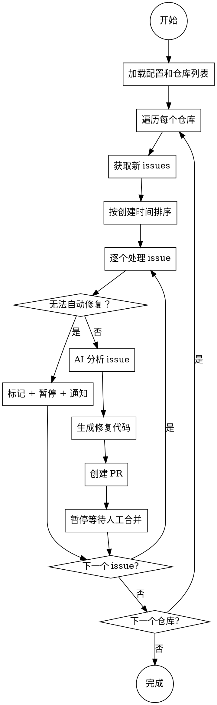

# Auto Fix GitHub Issues - 设计文档

## 概述

全局技能 `auto-fix-github-issues` 实现自动拉取 GitHub 仓库 Issues、分析问题、生成修复代码并创建 PR 的完整流程。支持多项目、多仓库配置。

---

## 触发方式

| 类型 | 实现 |
|------|------|
| **定时自动** | 使用 `loop` skill 设置间隔（如 `/loop 1h /auto-fix-issues`） |
| **手动触发** | 随时调用 `/auto-fix-issues` 命令 |

---

## 权限级别

- **生成 PR 模式**：AI 分析 issue 并生成修复代码，自动创建 PR
- **人工审核**：PR 创建后暂停，等待人工合并
- **暂停机制**：遇到无法自动处理的情况（如缺少上下文、架构决策）时暂停并通知用户

---

## 核心架构

```
~/.claude/skills/
└── auto-fix-github-issues/
    └── SKILL.md              # 主技能（无状态，配置驱动）

~/.claude/settings.json       # 全局仓库配置
~/.claude/state/               # 状态文件（最后处理的 issue ID）
```

### 工作流程



---

## 配置结构

### settings.json 配置格式

```json
{
  "autoFixGitHub": {
    "enabled": true,
    "repositories": [
      {
        "name": "powerverse",
        "owner": "liuzhi",
        "repo": "powerverse",
        "enabled": true,
        "labels": []
      },
      {
        "name": "other-project",
        "owner": "some-org",
        "repo": "some-repo",
        "enabled": true,
        "labels": ["bug", "enhancement"]
      }
    ],
    "notification": {
      "email": "liuzhi@example.com",
      "站内通知": true
    }
  }
}
```

### 状态文件

```
~/.claude/state/auto-fix-github-issues/
├── powerverse-last-issue.json   # 每个仓库独立状态
└── other-project-last-issue.json
```

状态文件内容：
```json
{
  "lastProcessedIssueNumber": 42,
  "lastProcessedAt": "2026-05-25T10:30:00Z",
  "paused": false
}
```

---

## 通知机制

### 触发通知的场景

1. **无法自动修复** - 需要人工介入
2. **PR 创建完成** - 等待合并
3. **处理完成** - 所有仓库扫描完毕

### 通知内容

```
[Auto Fix GitHub Issues]

仓库: liuzhi/powerverse
Issue #45: 修复GPU列表重复问题
状态: 需要人工介入
原因: 涉及数据库迁移，需要更多上下文
操作: 请人工审核并合并

---
GitHub PR: https://github.com/liuzhi/powerverse/pull/46
```

### 通知方式

- **站内消息**：直接输出到 Claude Code 界面
- **邮件**：发送到配置的邮箱

---

## 关键设计决策

### 1. 无状态技能

技能本身不存储任何状态，所有状态存储在：
- `settings.json` - 配置
- `~/.claude/state/auto-fix-github-issues/` - 每个仓库的处理进度

### 2. 配置驱动

新增仓库只需要在 `settings.json` 添加配置，无需修改技能代码。

### 3. 按创建时间处理

多 issue 同时存在时，按 `created_at` 升序处理（先创建的先处理）。

### 4. 失败处理策略

遇到以下情况时暂停：
- 需要更多上下文才能理解 issue
- 涉及架构决策或设计变更
- 代码生成失败
- API 调用失败

### 5. 跳过已处理的 issue

通过状态文件记录 `lastProcessedIssueNumber`，只处理该编号之后的新 issue。

---

## 文件结构

```
~/.claude/skills/
└── auto-fix-github-issues/
    └── SKILL.md              # 主技能文档

~/.claude/state/               # 状态目录（如不存在则创建）
└── auto-fix-github-issues/
    └── {repo}-last-issue.json
```

---

## 依赖工具

- **GitHub CLI (`gh`)** - 与 GitHub API 交互
- **Git** - 代码克隆和分支操作
- **邮件发送工具** - 如 `sendmail` 或第三方邮件 API

---

## 安全考虑

1. **GitHub Token** - 通过 `gh auth` 管理，不需要在配置中存储明文 token
2. **分支命名** - 使用 `auto-fix/issue-{number}-{short-description}` 格式
3. **PR 描述** - 包含 issue 链接、修复说明、测试建议

---

## 待实现组件

1. **主技能 SKILL.md** - 配置说明、使用方法、工作流程
2. **配置验证逻辑** - 检查 settings.json 格式
3. **状态管理模块** - 读写状态文件
4. **GitHub 交互模块** - `gh issue list`, `gh pr create` 等
5. **通知模块** - 站内输出 + 邮件发送